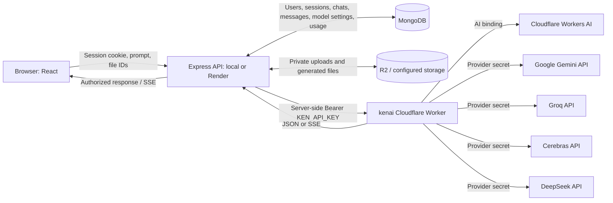

# Ken AI: data flow, fixes and live readiness — 3 October 2026

## Verdict

### Follow-up: 4 October 2026

The 4 October check still received Cloudflare HTTP 429 / error 4006 after the
00:00 UTC reset, despite the account dashboard showing 0/10k neurons today.
Both a direct Cloudflare REST request and the real Express adapter through
the deployed Worker were rejected. The configured account matches the
dashboard. Worker authentication, model discovery and server routing passed;
the internal reason for Cloudflare's quota/analytics discrepancy remains
unconfirmed. A push or redeploy does not reset that account restriction, and
waiting another day is not a guaranteed fix.

Fresh short Gemini Flash Lite and Groq Qwen requests both returned HTTP 200
with nonempty text on 4 October; see [chat checks](worker-chat-check.json).
Groq/Gemini vendor calls remain independent of Workers AI's neuron allowance.
Keep the Render Worker URL and matching `KEN_API_KEY`, and the frontend's
public API URL, configured as documented below. The Worker's current AI
binding calls do not route through AI Gateway, so Gateway spend limits do
not protect this path until Gateway routing is explicitly added.

Cloudflare live testing must stay below **1,000 neurons total per day**.
Use conservative estimates, tiny text requests and a small number of
sequential calls. Do not run broad Cloudflare model or image inference
matrices without a verified aggregate budget. Mocked tests, health checks
and model discovery do not require Workers AI inference.

The complete app suite passed 1,065 tests (32 shared, 723 server, 310 client),
including real MongoDB integration tests. App typechecks, lint and production
builds passed. Worker typecheck and dashboard bundle build passed. A fresh
Worker test run was blocked by this workstation's native-library policy and
the alternate runner's `vitest/worker` module resolution; it did not establish
a new passing Worker test result. The previous 3 October Worker results below
remain historical.

The changes are prepared for a review branch. Production deployment still
requires Render's matching `KEN_API_KEY` and Worker URL, the frontend public
API URL, and the existing database/auth/email/storage settings. Cloudflare's
post-reset restriction is not resolved by this code change.

### Results from 3 October

Working chat is available through Groq and three Gemini models after the Worker fix. The complete multi-provider setup is **not fully ready**: Cerebras and DeepSeek reject generation with upstream HTTP 402, Gemini Pro returns 429, and Workers AI has exhausted its daily allocation. Authentication/model discovery is not proof of generation access.

The Worker fix was published to `kenai`, including its `ai.ken-ai.tech` custom domain. Final version: `78c0c656-fda9-4436-8814-91cfedba9ba9`. Express and frontend changes were built and tested locally; they were **not pushed or deployed to Render/Vercel** in this session. Production Express health is healthy with MongoDB connected, but its deployed source revision and authenticated browser chat were not verified.

## What caused the missing models

The Worker passed `redirect: "error"` to every external-provider fetch. Cloudflare's workerd runtime rejects that option before sending the request. The catch block then returned the same `provider_unavailable` error for every vendor. Express treats Worker discovery as authoritative, so failed discovery hid Gemini, Groq, Cerebras and DeepSeek from the selector. Auto was left with quota-exhausted Cloudflare models.

A regression test using the actual Workers `Request` constructor reproduced the failure. The Worker now uses `redirect: "manual"` and explicitly rejects redirects. Provider credentials stay on the fixed official destinations. This behavior is confirmed in [Cloudflare's runtime source](https://github.com/cloudflare/workerd/blob/main/src/workerd/api/http.c++), in `Request::constructor` and `tryParseRedirect`.

Two additional problems appeared after fixing transport:

- Cerebras's old `llama-3.3-70b` default was not in its model list. Its current shared catalog exposes `qwen-3.8-27b` and `gpt-oss-120b`; both are now included. See the [official Cerebras catalog](https://inference-docs.cerebras.ai/models/overview).
- DeepSeek discovery returned `deepseek-flash` and `deepseek-v4-pro`; both are now included. Stored `deepseek-chat` and `deepseek-v4-flash` selections resolve to Flash.
- Gemini 3.8 Flash rejected `reasoning_effort: "minimal"`. Changing it to `"low"` made real chat and streaming pass. The Express request builder now applies that setting when a quick turn requests reasoning `none` on this model.

The Worker also distinguishes key rejection, denied access, billing, rate limits, redirects, timeouts and network failure. It exposes only a safe code/message and numeric upstream HTTP status. The frontend's failed-turn card now retains the redacted error explanation after reload. Old failed messages without recorded explanations retain the generic message.

## Real provider tests

Authenticated requests used the existing shared secret without printing it. Each listed vendor model was tested with a short chat request and an independent SSE request. Passing means nonempty answer text; streaming also required text deltas and `[DONE]`.

| Provider | Model | Chat | Streaming | Current action |
| --- | --- | --- | --- | --- |
| Groq | `qwen/qwen3.8-27b` | 200, text | 200, text + DONE | Usable |
| Groq | `openai/gpt-oss-20b` | 200, text | 200, text + DONE | Usable |
| Groq | `openai/gpt-oss-120b` | 200, text | 200, text + DONE | Usable |
| Gemini | `gemini-3.5-flash-lite` | 200, text | 200, text + DONE | Usable |
| Gemini | `gemini-3.6-flash` | 200, text | 200, text + DONE | Usable |
| Gemini | `gemini-3.8-flash` | 200, text | 200, text + DONE | Usable with low reasoning |
| Gemini | `gemini-3.1-pro-preview` | 429 | 429 | Check that project's model quota/billing |
| Cerebras | `qwen-3.8-27b` | Upstream 402 | Upstream 402 | Check account credits/billing |
| Cerebras | `gpt-oss-120b` | Upstream 402 | Upstream 402 | Check account credits/billing |
| DeepSeek | `deepseek-flash` | Upstream 402 | Upstream 402 | Check account balance/billing |
| DeepSeek | `deepseek-v4-pro` | Upstream 402 | Upstream 402 | Check account balance/billing |
| Workers AI | `@cf/meta/llama-3.2-3b-instruct` | 429, daily quota | 429, daily quota | Wait for reset or upgrade Workers plan |

All external providers' model-list endpoints returned 200. Cerebras/DeepSeek discovery proves the Worker can reach the account; a new key alone does not resolve their generation billing restriction. No billing changes or purchases were made.

Worker health at both addresses and Render API health returned 200. The local registry using the real database listed all five providers; quick Auto selected Groq Qwen. The actual Express adapter classes also produced real nonempty chat and streamed replies through the deployed Worker for Groq Qwen, Gemini Flash Lite and Gemini 3.8 Flash. These adapter probes did not create user messages or usage records.

Evidence: [provider matrix](provider-matrix-check.json), [local registry and adapter checks](local-model-check.json), [Cloudflare quota check](cloudflare-quota-check.json). JSON timestamps use UTC; add five hours for Pakistan time.

## Where data should flow



### Model selection

1. The browser requests authenticated `GET /api/models` from Express.
2. Express reads enabled provider/model settings from MongoDB and resolves Worker mode using its URL and shared secret.
3. Express queries `/v1/models` for Cloudflare and `/providers/{provider}/v1/models` for each external provider.
4. It intersects returned vendor IDs with the supported catalog, preserving known capabilities and enabled settings. Failed discovery hides the affected provider's models. The registry caches the list for up to 60 seconds.
5. The browser displays the resulting model list. Listing a model means it is configured and advertised, not that inference quota or billing is currently available.

### Chat and files

1. Express verifies the session and conversation/file ownership, checks app limits, and prepares context.
2. Manual selection uses that provider/model. Auto chooses a capable available model for the task; quick chat currently prefers Groq. Runtime failures may cause Auto to try another eligible provider. A manual pick stays on its chosen model.
3. Express persists the user/assistant turn and sends the selected provider request to the Worker. The Worker verifies the shared secret and replaces it with the vendor secret for upstream calls. Cloudflare inference uses the `AI` binding.
4. The reply travels back through Worker → Express → browser. Express persists the final response, status and usage. Errors retain a safe explanation.
5. File upload bytes go through Express to configured storage; metadata and ownership stay in MongoDB. Gemini image/PDF input goes through the Worker's native `/providers/gemini/v1beta/models/{id}:generateContent` or streaming endpoint. Images use the image tool and supported provider image routes, rather than chat model IDs.

Image/PDF generation, uploads, voice, search and full signed-in browser journeys were not live-tested in this session. Their availability must not be inferred from the text-chat tests.

## Where environment variables belong

| Location | Required AI configuration |
| --- | --- |
| `kenai` Worker Secrets | `KEN_API_KEY`, `GEMINI_KEYS`, `GROQ_KEYS`, optional usable `CEREBRAS_KEYS`, `DEEPSEEK_API_KEY` |
| `kenai` Worker binding | Workers AI binding named `AI` |
| Express on Render | `CLOUDFLARE_WORKER_URL=https://kenai.syedarslanshah7861.workers.dev/v1` and matching `KEN_API_KEY` |
| Local `server/.env` | Same Worker URL/shared secret when testing the local app |
| Production frontend | `VITE_API_BASE_URL=https://api.ken-ai.tech/api` |
| Local `client/.env` | `VITE_API_BASE_URL=http://localhost:5000/api` |

Provider keys belong on the `kenai` Worker, not in public `VITE_*` variables or JavaScript source. Putting a secret on a separate Pages project does not make it a binding of `kenai`. Keep existing MongoDB, auth, email and `STORAGE_*` values on Express. See [complete environment setup](WORKER_RENDER_SETUP.md).

Your screenshot is local: `localhost:5173` currently targets local Express at port 5000. A Render dashboard change does not change the running local server. The local read-only check confirmed Worker mode and shared-secret presence; it did not print their values.

## What to do now

1. Refresh the local page. If it still shows only Cloudflare, restart `npm run dev`, then refresh after discovery reloads. Model discovery can remain cached for 60 seconds. Select Groq Qwen or Gemini Flash Lite for an immediate working chat.
2. Deploy the changed Express/shared source to Render and frontend/shared source to its production host. The Worker is already updated; its dashboard bundle is `worker/Ken-AI-Worker.js`. This session did not push the repository, which also contains many pre-existing changes.
3. For Cerebras and DeepSeek, inspect account credit/billing in their provider consoles. Upstream 402 is the current generation blocker; regenerating keys is not established as necessary. Retest after account access is restored. These models may still appear because discovery succeeds.
4. Check Gemini Pro's model-specific quota or use a working Flash model. Its 429 does not prevent the three tested Flash models from answering.
5. Cloudflare's free AI allocation is 10,000 neurons per day and resets at **00:00 UTC / 05:00 PKT**. The next reset after these tests is **4 October 2026 at 05:00 PKT**. You can wait, use Groq/Gemini, or choose a Workers Paid upgrade for additional AI usage. [Cloudflare pricing](https://developers.cloudflare.com/workers-ai/platform/pricing/). External-provider inference in this Worker uses vendor APIs rather than `env.AI.run`, so exhaustion of the Workers AI neuron allocation does not stop those calls. The Worker's own request/runtime limits still apply.
6. After app deployments, confirm the production selector and signed-in Auto/manual chats, then verify file/image features before declaring the full application ready.

## Repeatable checks

```powershell
# One real chat + stream per supported provider; failures produce a nonzero exit.
node --import tsx docs/verify-worker-deployment.mts --chat --stream

# All supported external chat models; excludes quota-exhausted Cloudflare inference.
node --import tsx docs/verify-worker-deployment.mts --chat --stream --all-models --providers=gemini,groq,cerebras,deepseek --output=provider-matrix-check.json

# Real local registry + actual Express adapter calls, without writing chat records.
node --import tsx docs/verify-local-models.mts --chat
```

Local validation: 48 Worker tests plus typecheck/dashboard build; 90 server routing/provider tests plus 2 public-error tests; 24 frontend tests; 32 shared tests. Shared, server and frontend production builds passed. Targeted server/frontend lint passed. These are targeted checks, not a full repository test run.
