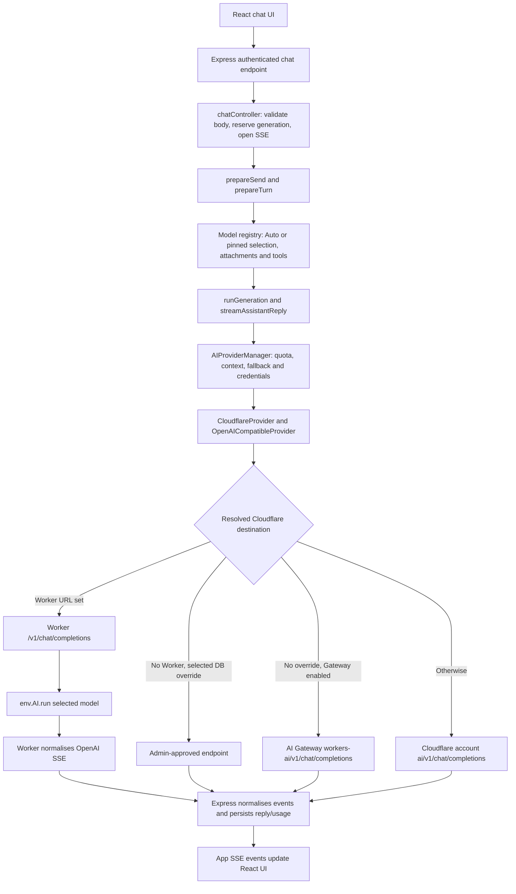

# Cloudflare AI calling flow aur Worker API recommendations

Date: 2026-10-03, Asia/Karachi.

Scope: current working-tree source aur local configuration ka read-only audit. Sirf yeh Markdown report add ki gayi hai. Application code, `.env`, database, Worker configuration aur deployment mein koi fix/change nahi kiya gaya. Pehle se workspace mein modified aur untracked files maujood the; findings current local source par hain, committed/deployed version ka claim nahi hain.

## 1. Sab se pehle finding

**Cloudflare ke liye custom Worker API ka support repo mein pehle se bana hua hai, lekin inspected local configuration mein woh activate nahi hai.**

Local `server/.env` aur is audit command ke inherited process environment ko secret values print kiye baghair check kiya:

| Setting | Inspected state | Asar |
| --- | --- | --- |
| `CLOUDFLARE_WORKER_URL` | Unset | Dedicated Worker mode activate nahi hota |
| `KEN_API_KEY` | Unset | Worker shared-secret authentication configured nahi |
| `CF_ACCOUNT_ID` | Present in `server/.env` | Native account URL ban sakta hai |
| `CF_TOKEN` | Present in `server/.env` | Workers AI REST authentication available |
| `CF_AI_GATEWAY_TOKEN` | Present in `server/.env` | Account ID ke saath AI Gateway enabled |
| `CF_AI_GATEWAY` | Unset | Code default `ken-ai-gateway` use karta hai |
| `IMAGE_GENERATION_PROVIDER` | `cloudflare` | Configured image chain Cloudflare se start hoti hai |

**Is local environment ka default Cloudflare path:** Express → Cloudflare AI Gateway → Workers AI. Chat mein stored admin/custom database endpoint is default ko override kar sakta hai. Image factory database endpoint/key use nahi karti, is liye uska Cloudflare path inspected environment ke mutabiq Gateway hai.

MongoDB provider records, running application process, Render environment aur deployed Worker ka source/version is audit mein inspect nahi kiya. Is liye live production ki actual destination ko confirmed nahi keh rahe. Credential presence token validity ya successful inference ka proof bhi nahi hai.

## 2. Teen routes ka farq

| Mode | Express kis ko call karta hai? | Authentication | Kab choose hota hai? |
| --- | --- | --- | --- |
| Native REST | `api.cloudflare.com` | Cloudflare API token | Worker mode absent, selected DB override absent, Gateway disabled |
| AI Gateway | `gateway.ai.cloudflare.com` | Provider token + Gateway token | Worker mode absent, selected DB override absent, Gateway enabled |
| Custom Worker API | Aapka Worker host | `KEN_API_KEY` shared secret | `CLOUDFLARE_WORKER_URL` set ho |

AI Gateway URL use karna aur aapke custom Worker API ko call karna alag routes hain. Current app browser se Cloudflare credentials bhej kar AI call nahi karti; Cloudflare HTTP calls server-side adapters se hoti hain.

Cloudflare officially REST/OpenAI-compatible chat endpoints aur Worker ke `env.AI.run()` binding dono provide karta hai. [OpenAI-compatible endpoints](https://developers.cloudflare.com/workers-ai/configuration/open-ai-compatibility/), [Workers AI binding](https://developers.cloudflare.com/workers-ai/configuration/bindings/).

## 3. Chat ka poora request flow



1. **Frontend:** `chatApi.send()` sends `POST /api/chat`; existing conversation `conversationsApi.send()` sends `POST /api/conversations/:id/messages`. Edit/regenerate requests bhi isi generation pipeline tak aati hain. `streamRequest()` JSON body bhej kar app SSE events read karta hai. Client API base URL frontend configuration se resolve hota hai.
2. **Express:** `requireAuth` aur chat rate limit lagti hain. `chatController` shared schema se input validate karta hai, generation ID reserve karta hai, SSE headers/heartbeats start karta hai. Stop/disconnect Express generation ko abort karta hai.
3. **Preparation:** `prepareSend()` ownership, selected provider/model aur attachments resolve karta hai. `prepareTurn()` Auto classification ya pinned model validation, image intent, enabled tools aur attachment routing karta hai. User message aur streaming assistant placeholder persist hote hain.
4. **Generation:** `runGeneration()` app `start`/`model`/timing events emit karta hai. Text response ke liye `streamAssistantReply()` recent history, current turn, persona, summaries, document context aur tool results se prompt banata hai. Task ke hisaab se context/output budget apply hota hai.
5. **Manager:** `AIProviderManager.stream()` shared-platform user quota/spend checks, cooldown/fallback policy aur adapter execution control karta hai. Har attempt par attachment route, model alias, PDF text folding aur provider context fit apply ho sakte hain. Cloudflare image parts par vision model ID select hoti hai.
6. **Adapter:** `getAdapter()` → `resolveCredentials()` → `runtimeCredentials()` → `createProviderAdapter()`. Provider ID `cloudflare` ho to `CloudflareProvider` banta hai, jo chat generation/streaming `OpenAICompatibleProvider` se inherit karta hai. Image-generation model ID ko chat endpoint par reject karta hai.
7. **Actual outbound HTTP:** `fetchChatCompletion()` selected base URL ke saath `/chat/completions` append karke POST karta hai. Yeh woh point hai jahan Cloudflare chat ki network call hoti hai.
8. **Response:** Adapter `choices[0].delta.content`, finish reason aur usage read karta hai; reasoning fields/inline think blocks visible text se filter karta hai. Express chunks ko app events mein convert karta hai, executed provider/model ke saath message, conversation aur usage save karta hai, phir complete/error/aborted event bhejta hai.

App SSE aur upstream OpenAI SSE ke formats alag hain. Worker OpenAI SSE deta hai; Express usay app ke `start`, `chunk`, `model`, `timing`, `complete`, `error`, `aborted` events mein translate karta hai.

## 4. Destination aur key kis tarah choose hoti hai?

Main function: [`resolveCredentials()`](../server/src/services/ai/credentials.ts), around line 204.

### Worker mode

`providerId === "cloudflare"` aur `CLOUDFLARE_WORKER_URL` present ho to early return hota hai:

```text
baseUrl    = CLOUDFLARE_WORKER_URL
apiKey     = KEN_API_KEY
source     = environment
configured = Boolean(KEN_API_KEY)
```

Is branch mein personal Cloudflare API token aur stored global key/endpoint choose nahi hote. Global provider ka enabled/disabled flag phir bhi respected hai. Worker mode mein Cloudflare BYOK effectively platform shared-key mode ho jata hai.

`env.ts` HTTPS Worker URL ending in `/v1` validate karta hai, credentials/query/hash reject karta hai, trailing slash normalise karta hai. Worker URL ke saath missing `KEN_API_KEY` configuration validation fail karta hai.

### Worker mode absent ho

Endpoint priority:

```text
selected stored provider baseUrl
    → gatewayBaseUrl("cloudflare")
    → cloudflareBaseUrl()
    → built-in default, if any
```

Legacy automatically stored exact built-in defaults, jin par explicit admin provenance nahi hai, ko implicit default treat kiya ja sakta hai. Custom endpoints aur explicitly marked admin endpoints preserved hain.

Key priority generally:

```text
enabled personal user credential
    → stored global/admin encrypted key
    → environment CF_TOKEN
```

User base URL ko approved endpoint se match karna hota hai. `CF_ACCOUNT_ID` aur `CF_TOKEN` ke aliases `CLOUDFLARE_ACCOUNT_ID`, `CLOUDFLARE_API_TOKEN` / `CLOUDFLARE_API_KEY` supported hain.

`runtimeCredentials()` Gateway token sirf installation ke matching Gateway endpoint ko attach karta hai. Custom Worker ko normal runtime path mein `cf-aig-authorization` nahi bhejta.

## 5. Actual chat URLs, headers aur payload

| Route | Outbound POST URL |
| --- | --- |
| Native | `https://api.cloudflare.com/client/v4/accounts/<account-id>/ai/v1/chat/completions` |
| Gateway | `https://gateway.ai.cloudflare.com/v1/<account-id>/<gateway-name>/workers-ai/v1/chat/completions` |
| Worker | `https://<worker-host>/v1/chat/completions` |

Native mein `Authorization: Bearer <CF_TOKEN>` hota hai. Stored/user credential use ho to woh key is header mein aati hai. Gateway mein iske saath `cf-aig-authorization: Bearer <CF_AI_GATEWAY_TOKEN>` lagta hai. Worker mode mein `Authorization: Bearer <KEN_API_KEY>` lagta hai.

Streaming Cloudflare request ka representative shape:

```json
{
  "model": "@cf/meta/llama-3.2-3b-instruct",
  "messages": [
    { "role": "system", "content": "<prepared system/context instructions>" },
    { "role": "user", "content": "<user message>" }
  ],
  "stream": true,
  "stream_options": { "include_usage": true },
  "max_tokens": 512
}
```

`512` sirf example hai. Actual budget task/neuron tier aur `cloudflareMaxTokens()` se banta hai. Catalog context window, estimated input aur safety margin output ask ko constrain karte hain. Non-streaming `generate()` bhi same endpoint use karta hai, streaming fields ke baghair.

## 6. Cloudflare model kab call hota hai?

| Trigger | Cloudflare involvement |
| --- | --- |
| Manually pinned Cloudflare chat model | Selected model, subject to attachment/model preparation |
| Auto normal/quick text | Preferred hosted models unavailable hon to Cloudflare candidates consider ho sakte hain |
| Retryable Auto failure | Fallback chain mein cheap Cloudflare 3B, phir 1B hops hain |
| Vision | Scout attachment/vision candidate hai; actual route capabilities aur availability par depend karta hai |
| Long context | Scout configured/eligible ho to candidate hai |
| Image creation | Image provider pipeline; chat completions endpoint use nahi hota |
| Thread title | Groq env key preferred; otherwise Cloudflare 1B if env credentials available; otherwise thread route |
| Rolling conversation summary | Same cheap route policy; manager ka non-streaming `generate()` |

Relevant IDs:

```text
Default Cloudflare fallback: @cf/meta/llama-3.2-3b-instruct
Tiny/title/summary:          @cf/meta/llama-3.2-1b-instruct
Vision:                     @cf/meta/llama-4-scout-17b-16e-instruct
Manual quality option:      @cf/meta/llama-3.3-70b-instruct-fp8-fast
Default image generation:   @cf/black-forest-labs/flux-1-schnell
```

Source: shared constants, `autoRoute.ts`, `primaryModel.ts`, `fallbackController.ts`. Fallback is not one fixed URL switch: har hop par provider/model, credentials, attachment suitability aur context re-evaluate hote hain.

Current regular pinned chat path `fallbackPolicy: "none"` deta hai: quota/503 par automatic provider substitution nahi hoti. Auto aur generated-image caption path retryable fallback allow kar sakte hain. Image attachment routing ek separate preparation decision hai. Purani routing documentation ka pinned quota-hop description current executable branch ka substitute nahi hai.

Titles aur summaries `skipQuota: true` aur `fallbackPolicy: "none"` use karte hain. Yeh app per-user quota bypass hai; upstream Cloudflare inference usage phir bhi consume ho sakti hai. Worker mode active ho to inki Cloudflare calls bhi central credential resolver se Worker par jayengi.

## 7. Image-generation ka separate poora flow

```text
Chat image intent / selected image model / POST /api/tools/images
  → ToolManager.execute("image_generation")
  → image request rate limit
  → FailoverImageProvider.generate()
  → CloudflareImageProvider.generate() when Cloudflare is attempted
  → Worker /ai/run/<model>, Gateway model route, or native /ai/run/<model>
  → read raw bytes or JSON base64 image
  → detect MIME from image bytes
  → uploadUserFile(): metadata.generatedBy records actual producer
  → attach generated file to assistant reply
```

| Mode | Cloudflare image POST URL | Key |
| --- | --- | --- |
| Native | `https://api.cloudflare.com/client/v4/accounts/<account-id>/ai/run/<model-id>` | `CF_TOKEN` |
| Gateway | `https://gateway.ai.cloudflare.com/v1/<account-id>/<gateway-name>/workers-ai/<model-id>` | `CF_TOKEN` + Gateway token |
| Worker | `https://<worker-host>/ai/run/<model-id>` | `KEN_API_KEY` |

`createImageGenerationProvider()` environment se image adapters construct karta hai. Worker URL set ho to account placeholder `worker`, token `KEN_API_KEY` aur Worker run URL use karta hai; `CF_ACCOUNT_ID` ki Cloudflare image readiness ke liye zaroorat nahi rehti. Worker URL se `/v1` remove karke `/ai/run/<model-id>` banata hai.

Schnell JSON `{ "prompt": "...", "steps": 4 }` use karta hai. Other JSON image models `{ "prompt": "..." }` use karte hain. Flux 2 models multipart form mein prompt, width aur height bhejte hain. Response parser raw JPEG/PNG/WebP bytes aur supported JSON/base64 envelopes handle karta hai.

Pure image-only turn `runGeneration()` mein chat response stream skip karta hai. Normal text turn ke saath generated image ho to caption model ka additional chat call ho sakta hai. Enabled/configured Gemini/OpenAI image backends failover chain mein aa sakte hain; explicitly pinned image backend/model request chain ko restrict karti hai.

Image factory module load par singleton banati hai: environment switch effective karne ke liye server restart/redeploy chahiye. Sirf admin database mein chat endpoint badalne se image route Worker par nahi jata.

## 8. Repo ke current Worker ke andar kya hota hai?

Source: [`worker/src/index.ts`](../worker/src/index.ts). Wrangler mein Worker name `kenai`, main `src/index.ts`, aur `AI` binding configured hai.

| Endpoint | Behavior |
| --- | --- |
| `OPTIONS` | CORS preflight, no AI inference |
| `GET /health` | Public configuration-presence status; successful inference test nahi |
| `GET /v1/models` | Authenticated allowed-model list, including image models |
| `POST /v1/chat/completions` | Authenticated text/vision chat, JSON or SSE |
| `POST /ai/run/<model-id>` | Authenticated allowed image model, JSON/multipart input |

Worker `Authorization: Bearer ...` aur `X-API-Key` dono accept karta hai. Expected `KEN_API_KEY` Worker secret mein hona chahiye. Auth key digest comparison se check hoti hai; missing secret par authenticated endpoints fail closed hote hain.

Chat handler:

```text
Authenticate
  → parse body and allowlisted model
  → validate roles/content and vision compatibility
  → cap max_tokens, preserve stream/stream_options
  → runModel(env, model, input)
  → env.AI.run(model, input, optional Gateway options)
  → normaliseCompletion() or toOpenAIStream()
```

Messages system/user/assistant/tool roles support karte hain. Vision content sirf inline PNG/JPEG/WebP data URLs accept karta hai; arbitrary remote image URLs aur native document blocks supported nahi. Cloudflare document turns ka extracted text Express mein prepare hota hai.

Current Worker policy constants: nominal body limit `1_000_000`, messages 1–200, default output 4096, output cap 16,384. Chat body guard text length bhi check karta hai; yeh implementation limits hain, Cloudflare platform limits nahi.

Image handler image capability/allowlist validate karke `env.AI.run()` use karta hai. Binary/stream output ko bytes aur object output ko `{ "success": true, "result": ... }` mein return karta hai, jise server image parser handle karta hai.

`AI_GATEWAY_ID` Worker environment mein set ho to `runModel()` binding ke third argument mein `{ gateway: { id: AI_GATEWAY_ID } }` bhejta hai. Yeh Express ka `CF_AI_GATEWAY` variable automatically inherit nahi karta. Worker binding ke saath Gateway options Cloudflare docs mein supported hain. [Workers AI with AI Gateway](https://developers.cloudflare.com/ai-gateway/usage/providers/workersai/).

Worker users/history/app quotas store nahi karta aur internal model fallback nahi karta. Model selection/fallback Express own karta hai. `mapAiError()` quota, busy, unavailable aur invalid input ko HTTP/error codes mein map karta hai.

## 9. Model listing aur connection checks

1. Shared [`cloudflareModels.ts`](../shared/src/constants/cloudflareModels.ts) Express catalog aur Worker allowlist ko data deta hai. Disabled IDs dono sides filter karte hain. Current shared quarantine list mein `@cf/qwen/qwen3.8-27b` hai; yeh local list ki finding hai, fresh live availability test nahi.
2. Native/Gateway mode mein normal adapter `getModels()` built-in catalog deta hai. Credential connection probe native account `/ai/models/search` use kar sakta hai, including Gateway configuration ke case mein. Is GET ka native host par jana generation route ka proof nahi hai.
3. Worker mode mein adapter `GET <base>/models`, yani `/v1/models`, ko `KEN_API_KEY` ke saath call karta hai. Five-second discovery timeout hai.
4. `ModelRegistry` built-in + stored models merge karta hai, phir custom Worker ki advertised list ko authoritative treat karta hai. Discovery fail ho to unverified Cloudflare models unavailable ho jate hain; cached model list normally 60 seconds tak reuse hoti hai.
5. Public picker Llama IDs filter karta hai; internal routable list mein Llama fallback models reh sakte hain. UI mein Llama hide hone ka matlab Workers AI code absent hona nahi.

## 10. Migration se pehle review karne wali findings — koi fix apply nahi hua

| Finding | Evidence aur consequence | Suggested next work |
| --- | --- | --- |
| Worker code ready, inspected env mode off | Worker URL/shared key absent; native/Gateway default selected | Contract verify karne ke baad environment-based switch use karein |
| Deployed Worker contract unverified | Old audit docs mention root POST, `prompt/content`, `answer/model`; current source has `/v1` messages/choices and image route | Deployment ko current source ke saath match karein. Old prompt-only Worker ke root ko current adapter base banana compatible nahi |
| Streaming error frame consume nahi hota | Worker `toOpenAIStream()` `{error: ...}` SSE frame emit karta hai; server adapter loop `choices`/`usage` read karta hai, `body.error` check nahi karta | Before rollout, error frame ko explicit provider failure tak propagate karna aur failure-after-partial-output behavior verify karna |
| Diagnostic ping Worker route faithfully follow nahi karta | `pingCloudflareModels.ts` Gateway URL ko `cloudflareBaseUrl()` se pehle choose karta hai; image URLs native/Gateway hain; still account ID require karta hai | Worker-aware probes banayein before using this script as migration evidence. Worker key Gateway/native host ko ja sakti hai if this existing script is run under mixed configuration |
| Existing Worker tests current behavior se drift karte hain | Model-list test expects only `ALLOWED_MODELS` chat IDs, handler `MODELS` including images returns; thrown-error test expects 502 while current `mapAiError()` generic error gives 503 | Tests/expected contract reconcile karein; existing tests ko passing proof na samjhein. Is audit mein tests run nahi hue |
| Tool capability full protocol ka proof nahi | Worker chat parser only role/content preserves; handler `tools`, `tool_choice`, tool-call IDs/assistant `tool_calls` forward nahi karta | Current app pre-run tools document karein; future native function calling chahiye to contract separately extend/verify karein |
| Stop does not prove upstream inference stopped | Express fetch/stream aborts; Worker `runModel()` explicitly request abort signal ko `env.AI.run()` se link nahi karta | Cancel-before-first-token and cancel-midstream ko verify karein; neuron savings assume na karein |
| Model discovery is a dependency | Worker `/v1/models` auth/timeout/schema issue Cloudflare picker availability affect karta hai | Listing, credentials, chat aur images ko separately validate karein |

SSE error handling aur test drift source inspection se identified hain; failing runtime reproduction is audit mein execute nahi hua.

`docs/cloudflare-diagnose.mts` bhi explicit native catalog probe aur optional direct/Gateway inference probes rakhta hai. `checkCatalogDrift.ts` Worker base URL set ho to `/v1/models` use kar sakta hai. In scripts ke routes ko normal production generation routes se separate samjhein. Is audit mein koi inference/diagnostic script execute nahi ki gayi.

## 11. Suggested Worker API architecture

**Recommendation: existing server-side OpenAI-compatible contract ko retain karke Cloudflare transport Worker API par switch karein.**

```text
React
  → Express: session auth, ownership, quotas, routing, history, storage, SSE
  → authenticated Worker API: allowlist, input checks, response normalisation
  → env.AI.run(): Cloudflare inference
  → optional AI Gateway via Worker binding options
```

Is design mein existing central resolver Cloudflare chat, fallback hops, titles aur summaries ko Worker par route kar sakta hai; existing image factory Cloudflare image calls bhi Worker par route kar sakti hai. Naya frontend Cloudflare SDK ya browser shared secret ki zaroorat nahi.

### Suggested configuration example — apply nahi kiya gaya

Express environment:

```dotenv
CLOUDFLARE_WORKER_URL=https://<confirmed-worker-host>/v1
KEN_API_KEY=<same-strong-shared-secret-as-worker>
IMAGE_GENERATION_PROVIDER=cloudflare
```

Worker environment/configuration:

```text
AI binding = enabled (already in local wrangler.jsonc)
KEN_API_KEY = stored Worker secret, same value as Express
AI_GATEWAY_ID = chosen gateway ID, only if Worker-side Gateway telemetry wanted
```

Worker mode ke Cloudflare runtime chat/images ke liye Express `CF_TOKEN` / `CF_ACCOUNT_ID` required nahi hote. Account ID/Gateway token other providers ke existing Gateway routes aur diagnostic scripts ko phir bhi chahiye ho sakte hain; migration mein inko blindly remove na karein. Worker-mode resolver environment URL ko DB/user Cloudflare endpoint/key se pehle choose karta hai, is liye switching only admin provider record se kam predictable hai.

`CF_AI_GATEWAY_TOKEN` Express mein rehne se Groq/Gemini/OpenAI/OpenRouter Gateway routing bhi affect hoti hai. Cloudflare Worker mode ka early branch independent hai. Agar request hai ke **har AI provider** custom Worker se guzre, current Worker source uska implementation nahi: woh Cloudflare models ke liye `env.AI.run()` front hai. Other vendor routing separate future scope hoga.

Worker API central authentication/validation ka faida deta hai. Isse Cloudflare model/account quota, plan access ya inference pricing automatically change nahi hoti. Platform constraints current [Workers AI limits](https://developers.cloudflare.com/workers-ai/platform/limits/) aur [Workers limits](https://developers.cloudflare.com/workers/platform/limits/) se evaluate karein.

### Suggested execution order for a later implementation task

1. Confirm deployed Worker URL/version aur `/v1/models`, `/v1/chat/completions`, `/ai/run/<model>` contracts match current source.
2. SSE error propagation aur outdated Worker test expectations address/verify karein.
3. Shared-secret auth, missing/wrong key, allowed-model list, non-stream response aur streaming response verify karein.
4. Vision inline images, PDF extracted text aur JSON/multipart image models verify karein.
5. Titles/summaries, Auto fallback, pinned model preservation, usage accounting aur Stop behavior verify karein.
6. Worker-aware diagnostic paths verify karein; then Express environment switch aur restart/redeploy karein.
7. Runtime destination evidence/logs se confirm karein ke Cloudflare generation Worker host par ja rahi hai. Gateway telemetry wanted ho to Worker-side `AI_GATEWAY_ID` validate karein.

Yeh sequence suggestions hain. Deploy, secret setup, environment edit, bug fix ya paid inference is audit mein nahi kiya gaya.

## 12. Source map

Line numbers audit-time orientation hain; future edits se shift ho sakte hain.

| Source | Relevant symbol / approximate line | Role |
| --- | --- | --- |
| [client API chat](../client/src/services/api/chat.ts) | `chatApi`, `conversationsApi` | Send/edit/regenerate URLs |
| [client stream](../client/src/services/api/client.ts) | `streamRequest`, line 15 | App SSE reader |
| [chat routes](../server/src/routes/chat.ts) | Auth + POST handler | Entry point |
| [chat controller](../server/src/controllers/chatController.ts) | `streamFromPrepare` | Validation, heartbeat, cancellation, events |
| [generation preparation](../server/src/services/chat/prepareGeneration.ts) | `prepareSend`, line 28 | Persist/prepare turn |
| [turn preparation](../server/src/services/chat/prepareTurn.ts) | `prepareTurn`, line 86 | Auto/pin/tools/attachments/image-only |
| [generation](../server/src/services/chat/runGeneration.ts) | `runGeneration`, line 21 | Execution, persistence, usage, background upkeep |
| [text stream](../server/src/services/chat/streamTurn.ts) | `streamAssistantReply`, line 88 | Prompt and manager stream |
| [provider manager](../server/src/services/ai/AIProviderManager.ts) | `stream`, line 116; `getAdapter`, line 531 | Quota, context, retries, adapter |
| [credentials](../server/src/services/ai/credentials.ts) | `cloudflareBaseUrl`, line 71; `resolveCredentials`, line 204 | Destination/key precedence |
| [endpoint policy](../server/src/services/ai/endpointPolicy.ts) | `runtimeCredentials`, line 20 | Gateway-token scoping |
| [gateway URLs](../server/src/services/ai/aiGateway.ts) | `gatewayEnabled`, line 55; run URL, line 91 | Native Gateway URL builders |
| [adapter factory](../server/src/services/ai/createProviderAdapter.ts) | `createProviderAdapter` | Cloudflare-specific adapter |
| [Cloudflare adapter](../server/src/services/ai/providers/CloudflareProvider.ts) | Class, line 18; `getModels`, line 38 | Chat/image separation, model discovery |
| [HTTP chat adapter](../server/src/services/ai/providers/OpenAICompatibleProvider.ts) | `stream`, line 160; fetch, line 412 | Actual POST and SSE consumption |
| [chat body](../server/src/services/ai/providers/compatibleChatBody.ts) | Budget, line 132; builder, line 147 | Messages, usage and token fields |
| [registry](../server/src/services/ai/ModelRegistry.ts) | Worker discovery, line 137 | Available models + caching |
| [shared Cloudflare catalog](../shared/src/constants/cloudflareModels.ts) | `CLOUDFLARE_MODELS`, disabled IDs | Shared model/capability list |
| [title](../server/src/services/chat/chatTitle.ts) | `resolveTitleRoute`, `generateChatTitle` | Additional non-stream model call |
| [summary](../server/src/services/chat/conversationSummary.ts) | `refresh`, manager call line 174 | Additional non-stream model call |
| [tool manager](../server/src/services/tools/ToolManager.ts) | Image branch, line 113 | Image tool + file persistence |
| [image factory](../server/src/services/image/index.ts) | Factory line 40; run options line 68 | Environment chooses image transport |
| [Cloudflare images](../server/src/services/image/CloudflareImageProvider.ts) | `generate`, request/response helpers | Actual image POST |
| [image failover](../server/src/services/image/failoverImageProvider.ts) | `generate` | Backend fallback and deadline |
| [environment](../server/src/config/env.ts) | Worker schema line 85; exported URL line 240 | Validation and URL normalisation |
| [Worker source](../worker/src/index.ts) | `runModel` line 74; stream line 180; fetch line 279 | Worker auth/routes/AI binding |
| [Worker configuration](../worker/wrangler.jsonc) | `name`, `main`, `ai.binding` | Runtime binding configuration |
| [Worker tests](../worker/test/index.spec.ts) | Listing line 60; error expectation line 147 | Existing, partly stale contract tests |
| [live ping script](../server/src/scripts/pingCloudflareModels.ts) | URL builders line 63; guard line 310 | Separate diagnostic inference routes |
| [catalog drift script](../server/src/scripts/checkCatalogDrift.ts) | `fetchLiveModelIds`, `checkProvider` | Separate listing route |
| [diagnostic script](cloudflare-diagnose.mts) | Explicit native/Gateway probes | Separate diagnostic route |

## 13. Audit verification boundaries

- Source call sites, credential/URL precedence, frontend entry points, streaming response path, image path and Worker handlers manually traced.
- Local environment inspected using presence flags; no secret values included in this report/output.
- Current Cloudflare primary documentation retrieved for binding, REST/OpenAI compatibility, Gateway options and platform limits.
- No app startup/bootstrap, MongoDB queries/writes, authenticated deployed Worker calls, model inference, tests, deployment or configuration edits performed.
- This report documents supported/local behavior and future suggestions. Runtime success and production endpoint selection still need the targeted verification above.
