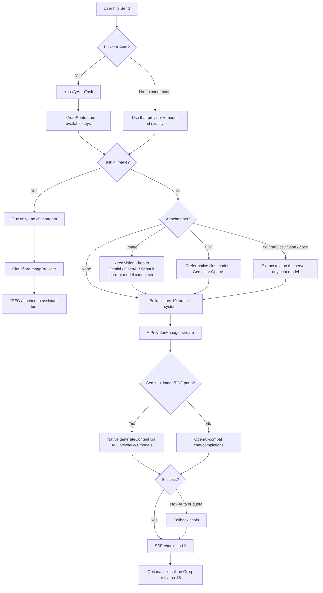
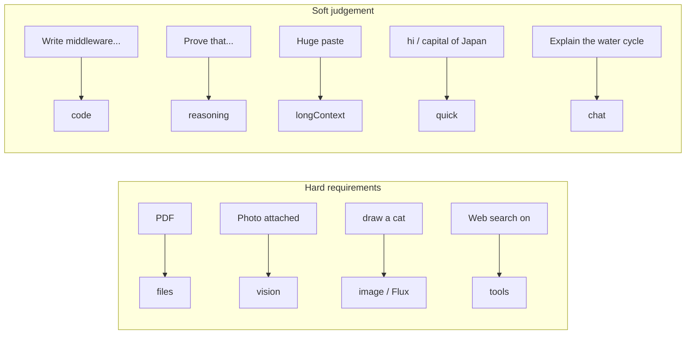
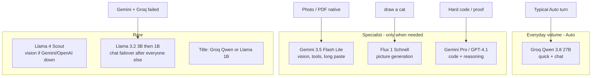
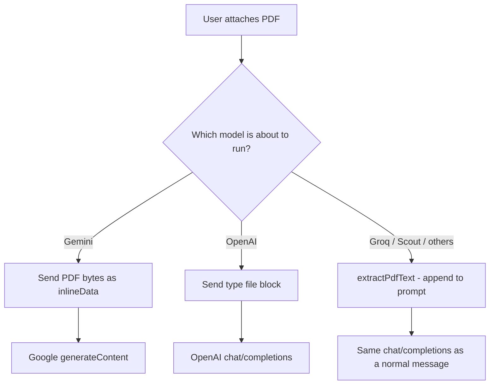

# How Ken routes a user request

This is the map of **what happens after Send**. It is how the code actually behaves (`autoRoute.ts`, `chatService.ts`, `AIProviderManager.ts`, `catalog.ts`), not a wishlist.

Ken has **no Anthropic / Claude provider**. Claude is not in the picker and never receives a chat turn.

**Catalog is not the same as “this machine is calling GPT.”** OpenAI models (`gpt-4o-mini`, `gpt-4.1`) exist in `catalog.ts` so they *can* run if `OPENAI_API_KEY` is set. Auto only picks a model the registry marks `available` (key present). If that env var is missing or empty, **no ChatGPT request is ever sent.** The same rule applies to OpenRouter, DeepSeek, and Cerebras.

Open this file in any Markdown preview that supports [Mermaid](https://mermaid.js.org) (GitHub, VS Code, Cursor) to see the diagrams.

---

## 1. The 10-second version

| What the user does | Who actually answers (when keys exist) |
| --- | --- |
| Auto + “hi” / short fact | **Groq Qwen 3.8 27B** |
| Auto + normal explanation | **Groq Qwen 3.8 27B** (or GPT-OSS 120B if the question is heavier chat) |
| Auto + photo attached | **Gemini 3.5 Flash Lite** (native vision) |
| Auto + PDF attached | **Gemini Lite** native PDF if Google is configured. GPT-4o mini only if `OPENAI_API_KEY` is set. Otherwise: extract text and stay on a chat model |
| Auto + “draw a cat” / Flux pinned | **Cloudflare Flux 1 Schnell** (image tool, not chat) |
| Auto + web search on | **Gemini Lite** (needs `tools`) |
| Auto + hard code / proof | **GPT-4.1** or **Gemini 3.1 Pro** |
| Auto + huge pasted document (~8k+ tokens) | **Gemini Lite** (long context) |
| User pins a model | **That exact model.** Ken does not silently swap it. Failover only for **quota**, not for timeouts. |
| Sidebar title after first reply | **Groq Qwen**, else **Cloudflare Llama 3.2 1B**. Never Pro, never 70B. |

**Most turns in Auto, with Groq + Gemini keys set, hit Groq Qwen.** Gemini is reserved for vision, tools, long paste, and reasoning. Cloudflare chat is last-resort failover, not everyday traffic. Flux is only picture generation.

---

## 2. Layers (who talks to whom)

```text
Browser (React)
  │  POST /api/chat  or  POST /api/conversations/:id/messages
  │  cookies only — never provider keys
  ▼
Express  →  chatController  →  chatService.prepareSend / runGeneration
  │
  ├─ Auto?     →  planAutoRoute()          (no model call, no tokens)
  ├─ Image?    →  CloudflareImageProvider  (Flux /ai/run)
  ├─ Files?    →  fileService.materialize  then hop or extract
  └─ Chat      →  AIProviderManager.stream
                    │
                    ├─ Gemini text   →  OpenAI-compat /chat/completions  (via AI Gateway if on)
                    ├─ Gemini image/PDF →  native generateContent
                    ├─ Groq / OpenAI / CF chat →  OpenAI-compat /chat/completions
                    └─ Flux          →  Workers AI /run/{flux-id}
```

Application code never calls Google/Groq/OpenAI SDKs. It talks to `AIProviderManager`, which talks to one adapter in `server/src/services/ai/providers/`.

---

## 3. One send: the full tree



---

## 4. Auto: how the task is chosen

Auto is a **heuristic**, not a second model. Order is strict: the first match wins.

```text
classifyAutoTask(content, files, tools)
│
├─ PDF attached?                          →  files
├─ Image attached?                        →  vision
├─ Text looks like "draw / generate a picture"?  →  image
├─ Web search (or other tools) enabled?   →  tools
├─ Deep code request?                     →  code
├─ Math-heavy or long-budget question?    →  reasoning
├─ Prompt bigger than ~8,000 tokens?      →  longContext
├─ Greeting / short fact?                 →  quick
└─ Everything else                        →  chat
```



If the preferred task has **no capable model** (missing key):

- `tools` and `files` **degrade to chat** (tools are optional; PDFs can be extracted).
- `vision` and `image` **do not degrade** — Ken errors instead of answering as if the picture did not exist.

---

## 5. Auto: which model is tried first

Only models the registry marks **available** (key present, enabled) are chosen.

| Task | 1st choice | Then | Capability required |
| --- | --- | --- | --- |
| **quick** | Groq `qwen/qwen3.8-27b` | Cerebras Llama 70B → Groq GPT-OSS 20B → Gemini Lite → GPT-4o mini | `text` |
| **chat** | Groq Qwen 27B | Groq GPT-OSS 120B → Gemini Lite → Gemini 3.8 → GPT-4o mini | `text` |
| **code** | OpenAI `gpt-4.1` | Gemini Pro → Groq 120B → DeepSeek → Gemini 3.8 | `text` |
| **reasoning** | Gemini Pro | GPT-4.1 → Groq 120B → DeepSeek | `text` |
| **longContext** | Gemini Lite | Gemini 3.8 → Gemini Pro → GPT-4.1 → CF Scout | `text` |
| **vision** | Gemini Lite | Gemini 3.8 → GPT-4o mini → CF Scout | `vision` |
| **files** | GPT-4o mini | GPT-4.1 → Gemini Lite / 3.8 / Pro | `files` |
| **tools** | Gemini Lite | GPT-4o mini → Gemini 3.8 | `tools` |
| **image** | Flux 1 Schnell | *(none — Flux or error)* | `imageGeneration` |

Ollama is last resort only: used if **no hosted model** can serve the task.

---

## 6. What gets used most (by design)



**Why Groq leads chat:** Gemini’s free quota is the same bucket vision depends on. Putting greetings on Groq keeps Gemini for photos and tools.

**Why Cloudflare chat is last:** Workers AI free tier is ~10k neurons/day. Ken only uses the cheap 3B → 1B hops after Gemini/Groq/DeepSeek/Cerebras fail. Llama 70B is picker-only, not automatic failover.

---

## 7. Pinned model vs Auto

```text
Picker
├─ Auto
│    Thread stores providerId=auto, modelId=auto
│    Every send re-classifies and may pick a different model
│    Footer: "Auto · Gemini 3.5 Flash Lite" (what actually ran)
│    Failover: full chain (quota, 401, 5xx, hang)
│
└─ Pinned (e.g. Gemini 3.8 Flash, Groq Qwen, Flux)
     Thread stores that provider + id
     Every send uses that id (aliases only for retired names)
     Failover: quota only — a timeout does not swap the model
```

Ken will not answer a Pro thread on Lite while the header still says Pro.

---

## 8. Images: two completely different paths

```text
User intent
│
├─ CREATE a picture  ("draw a cat", "generate an image of a sunset")
│    detectImageRequest() = true
│    → image_generation tool
│    → Cloudflare Flux 1 Schnell  (/ai/run, not /chat/completions)
│    → JPEG stored, attached to the assistant message
│    → no chat model captions it on the image-only path
│
└─ LOOK at a picture  (upload / paste a PNG, "what's in this image?")
     attachmentNeed = vision
     Auto → Gemini Lite (native inlineData)
     Pinned Groq → hop to Gemini / OpenAI / Scout
     Cloudflare chat hop with an image → remapped to Llama 4 Scout
```

Flux is **not** a chat model. Asking it “what’s in this PDF?” is the wrong tool. Asking Gemini “draw a cat” still runs Flux first when Auto (or the detector) sees a creation request.

---

## 9. Documents: native vs extract

```text
Upload
│
├─ Images          → binary parts, vision model required
├─ PDF
│    ├─ Gemini     → native inlineData  (generateContent)
│    ├─ OpenAI     → type: "file" on chat/completions
│    └─ Groq / CF / others → extract text on the server, put it in the user message
│
├─ .docx           → always extract Word XML to text (no native Word ingest)
└─ .txt .md .csv .json → always extract to text
```



A Groq + PDF turn **prefers** hopping to Gemini/OpenAI so the PDF is read as a document. If those keys are missing, Ken **extracts** and stays on Groq instead of 400ing.

---

## 10. After the model is chosen: generate vs fallback

```text
AIProviderManager.stream
│
├─ 1. Attachment re-route if this hop cannot see an image
├─ 2. Alias retired ids (gemini-2.5-flash → 3.5-flash-lite, etc.)
├─ 3. Cloudflare + image parts → force Scout
├─ 4. Trim history to that provider's input budget
│       groq/cerebras  6,000 tokens
│       gemini        32,000
│       openai        24,000
│       cloudflare     4,096
│       history cap: last 10 messages
│
└─ 5. Call the adapter
      On failure (Auto / non-pinned):
         Gemini Lite → 3.8 → 3.6 → Pro
         → Groq Qwen → Groq 120B
         → DeepSeek → Cerebras
         → Cloudflare 3B → Cloudflare 1B
         (Scout if the turn has images)
```

Pinned turns skip step 5 except for **provider quota**.

---

## 11. Where the HTTP request actually goes

If `CF_AI_GATEWAY_TOKEN` + `CF_ACCOUNT_ID` are set, chat is proxied through Cloudflare AI Gateway. Vendor keys still authenticate the provider; the gateway token is `cf-aig-authorization`.

| Kind | URL shape (gateway on) |
| --- | --- |
| Groq chat | `gateway.../groq/chat/completions` |
| Gemini **text** | `gateway.../google-ai-studio/v1beta/openai/chat/completions` |
| Gemini **image/PDF** | `gateway.../google-ai-studio/v1/models/{id}:streamGenerateContent` |
| Cloudflare chat | `gateway.../workers-ai/v1/chat/completions` |
| Flux | `gateway.../workers-ai/@cf/black-forest-labs/flux-1-schnell` |

Gemini native **must** use `/v1/models/...`, not `/v1beta/models/...`. The wrong path 401s and looks like “model could not be reached.”

If the gateway native call still 401s, Ken retries **Google directly** (`generativelanguage.googleapis.com/v1beta/...`).

---

## 12. Hidden extra model calls (not the user’s turn)

| When | Model | Why |
| --- | --- | --- |
| First assistant reply on a new chat | Groq Qwen, else CF Llama 1B | Replace the dumb sidebar title (“Whats Int He Imaage Man”) |
| User enabled web search | Same turn’s model, plus search tool | Tool round-trip, then the model writes |
| Image generation | Flux only | Not a chat completion |

Identity (“you are Ken AI”) is injected only as a system prefix when the user asks who the model is; it is not a separate request.

---

## 13. Concrete examples

```text
"hi" + Auto
  → quick → Groq Qwen 3.8 27B → Groq /chat/completions

"explain how rain forms" + Auto
  → chat → Groq Qwen 3.8 27B

PNG attached + "what's in this"
  → vision → Gemini 3.5 Flash Lite → native generateContent

"IT Support CV.pdf" + "what's in the CV"
  → files → GPT-4o mini if OpenAI key, else Gemini Lite native PDF
  → if only Groq: extract PDF text → Groq chat

"draw a cat" + Auto
  → image → Flux → JPEG, no chat model

"draw a cat" + Groq pinned
  → detector still adds image_generation → Flux
  → thread stays Groq for the next text turn

Web search + "latest news"
  → tools → Gemini Lite

10-page paste into the box, no file
  → longContext → Gemini Lite (Groq's 6k input budget would truncate)

Gemini Lite 429 quota (Auto)
  → 3.8 → 3.6 → Pro → Groq → … → CF 3B → CF 1B
```

---

## 14. Code map

| File | Job |
| --- | --- |
| `server/src/services/chat/autoRoute.ts` | Auto classify + preferred models |
| `server/src/services/chat/chatService.ts` | Persist turn, Auto vs pin, Flux-only path, attachment hop |
| `server/src/services/chat/imageIntent.ts` | “Draw a …” vs “what’s in this image” |
| `server/src/services/ai/attachmentRoute.ts` | vision vs files hop |
| `server/src/services/storage/fileService.ts` | Extract vs native PDF parts |
| `server/src/services/storage/extractDocument.ts` | PDF / DOCX text extraction |
| `server/src/services/ai/AIProviderManager.ts` | Stream, fallback chain, Scout remap |
| `server/src/services/ai/primaryModel.ts` | `FREE_FALLBACK_CHAIN` |
| `server/src/services/ai/catalog.ts` | Picker models + capability flags |
| `server/src/services/ai/providers/GeminiProvider.ts` | Compat vs native |
| `server/src/services/ai/aiGateway.ts` | Gateway URLs |
| `server/src/services/image/CloudflareImageProvider.ts` | Flux |
| `server/src/services/chat/chatTitle.ts` | Cheap title hop |
| `server/src/services/chat/ContextManager.ts` | History + token budgets |

---

## 15. Catalog snapshot (chat + image)

```text
gemini
  gemini-3.5-flash-lite     text vision files streaming tools     ← default Gemini / Auto vision
  gemini-3.8-flash          same
  gemini-3.6-flash          same
  gemini-3.1-pro-preview    same                                 ← Auto reasoning/code
groq
  qwen/qwen3.8-27b          text streaming                       ← most Auto text
  openai/gpt-oss-20b        text streaming
  openai/gpt-oss-120b       text streaming                       ← Auto heavier chat / code hop
openai
  gpt-4o-mini               text vision files streaming tools    ← Auto files first
  gpt-4.1                   same                                 ← Auto code first
openrouter
  openai/gpt-4o-mini        text vision streaming tools
cloudflare
  @cf/meta/llama-4-scout-…  text vision streaming                ← vision last resort
  @cf/meta/llama-3.2-3b-…   text streaming                       ← chat failover
  @cf/meta/llama-3.2-1b-…   text streaming                       ← titles + last hop
  @cf/black-forest-labs/flux-1-schnell   imageGeneration only
  (+ other Workers AI chat ids in the picker; not Auto defaults)
```

There is **no Claude** in this tree.
